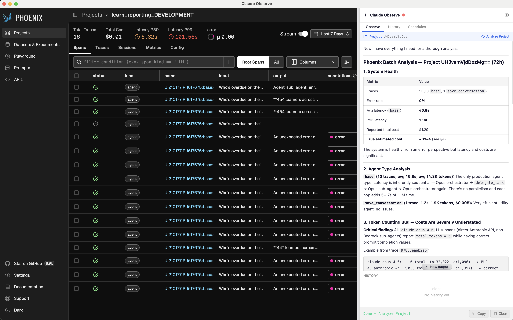
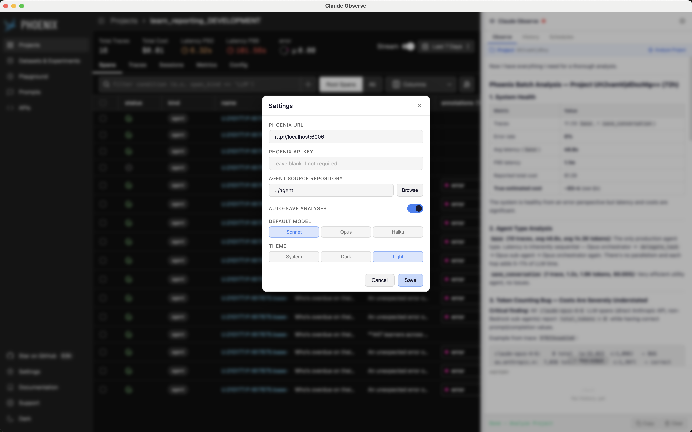

# Claude Observe

Electron app that wraps Phoenix LiveDashboard in a split-pane layout alongside a Claude Code sidebar panel. Phoenix on the left, Claude on the right — with context-aware commands, streaming output, and analysis history. No Phoenix modification required.



## Architecture

```
┌─────────────────────────────────────────────────────┐
│                  Electron App                       │
│                                                     │
│  ┌─────────────────────┬───────────────────────┐    │
│  │  Phoenix iframe     │   Claude Panel        │    │
│  │  (LiveDashboard)    │   ┌─────────────────┐ │    │
│  │                     │   │ Observe tab     │ │    │
│  │  URL polled for     │   │ History tab     │ │    │
│  │  context detection  │   │ Schedules tab   │ │    │
│  │  (project/trace/    │   └─────────────────┘ │    │
│  │   span/session)     │   Streaming output    │    │
│  │                     │   + analysis store    │    │
│  └────────┬────────────┴───────────┬───────────┘    │
│           │     IPC via preload    │                │
│  ┌────────▼────────────────────────▼───────────┐    │
│  │         Main Process (Node.js)              │    │
│  │  - Loads commands from /commands/*.json      │    │
│  │  - Spawns `claude -p --output-format         │    │
│  │    stream-json --verbose`                    │    │
│  │  - Streams NDJSON back via IPC              │    │
│  │  - Persists config + analyses to disk       │    │
│  └─────────────────────────────────────────────┘    │
└─────────────────────────────────────────────────────┘
```

## Quick Start

### Prerequisites

- Node.js 18+
- Phoenix running locally (`localhost:6006`)
- Claude Code CLI installed and in PATH (`claude --version`)

### Setup

```bash
cd phoenix-claude-watch
npm install
```

### Run

```bash
# Start Phoenix first, then:
npm start

# With DevTools:
npm run dev
```

## Usage

1. The app opens with Phoenix on the left and the Claude panel on the right
2. A draggable divider separates the panes (position persists between sessions)
3. The **context bar** shows what Phoenix page you're on (project, trace, span, or session)
4. Context-aware **command pills** appear in the Observe tab — click one to run it
5. Output streams in real-time as markdown in the panel
6. Completed analyses auto-save and appear in the **History** tab

## Commands

Commands are loaded from `commands/*.json` at runtime. Each command declares a `context` field that controls when it appears based on Phoenix navigation state.

| Command           | Description     | Context   | Model  |
| ----------------- | --------------- | --------- | ------ |
| `phoenix-trace`   | Analyze Trace   | `trace`   | Sonnet |
| `phoenix-span`    | Analyze Span    | `span`    | Sonnet |
| `phoenix-batch`   | Analyze Project | `project` | Sonnet |
| `phoenix-session` | Analyze Session | `session` | Sonnet |

### Adding Commands

Drop a JSON file in the `commands/` directory:

```json
{
  "name": "My Command",
  "description": "What it does",
  "icon": "🚀",
  "prompt": "The prompt to send to Claude Code",
  "model": "sonnet",
  "workingDir": "/path/to/project",
  "context": ["trace"]
}
```

### Template Variables

Use `{{variableName}}` in prompts — replaced at runtime with context from the Phoenix iframe URL.

## Configuration



Environment variables:

| Variable            | Default                 | Description                                   |
| ------------------- | ----------------------- | --------------------------------------------- |
| `PHOENIX_URL`       | `http://localhost:6006` | Phoenix dashboard URL                         |
| `PHOENIX_API_KEY`   | -                       | Authorization header for Phoenix API requests |
| `CLAUDE_BIN`        | `claude`                | Path to Claude Code CLI binary                |
| `CLAUDE_TIMEOUT_MS` | -                       | Timeout for Claude CLI subprocess             |
| `NODE_ENV`          | -                       | Set to `development` for DevTools             |

Runtime config is persisted at `~/.phoenix-claude-watch/config.json`.

## Project Structure

```
phoenix-claude-watch/
├── commands/                  # Command definitions (JSON)
│   ├── phoenix-trace.json
│   ├── phoenix-span.json
│   ├── phoenix-batch.json
│   └── phoenix-session.json
├── src/
│   ├── main.js                # Electron main process (IPC, Claude spawning, auth)
│   ├── preload.js             # contextBridge → window.claudeShell API
│   ├── shell.html             # Split-pane layout entry point
│   ├── shell.js               # Renderer UI (DOM manipulation, IIFE)
│   ├── shell.css              # Panel and layout styles
│   ├── analysis-store.js      # File-based analysis persistence
│   ├── marked.umd.js          # Vendored markdown renderer
│   └── lucide.min.js          # Vendored icon library
├── scripts/phoenix/           # Node CLI utilities for Phoenix API
│   ├── common.js
│   ├── fetch-trace.js
│   ├── fetch-span.js
│   ├── fetch-batch.js
│   ├── fetch-session.js
│   └── list-projects.js
├── docs/                      # Internal documentation
│   ├── analysis-persistence.md
│   ├── commands.md
│   ├── ipc-channels.md
│   └── phoenix-scripts.md
├── package.json
├── CLAUDE.md
└── README.md
```
